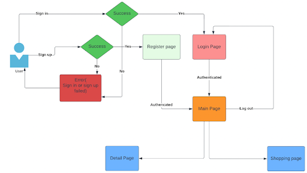

# REACT BOILERPLATE

## AUTHOR

- Your Name

## LIVE DEMO

- Live demo URL

## PERFORMANCE SCORE

- Mobile
- Desktop

## DESCRIPTION

- This document provides Everything you need to kick off your next Vite + React web app with TypeScript!

## TIMELINE

- ... days

## TASK MANAGEMENT

- Your GitLab repository board

## TARGETS

- Apply useContext for state management
- Take a narrow view to check re-rendering and optimize performance of one React application.
- Become better understood and create your own custom hook to reduce redundant code.
- Study and apply uncontrolled components in some cases to avoid needless state management gradually.
- Be aware of catching common and specific errors (errors from api, from logic,...) for one React application to prevent crashing issues dramatically.
- Check PageSpeed scores frequently during development time and ensure the scores at minimum 98 points.
- Keep moving with Storybook which will assist to manage components in the development environment.
- Practice shouldn’t consist of additional libraries namely React Query, React Hook Form, Zustand.

## REQUIREMENTS

- Implement UI with Template
- User can see ...
- User can add ...
- User can delete ...
- User can update ...
- User can see details ...
- Navigation to the other page with a new hook

## ENVIRONMENT

- Ubuntu/MacOS/Windows
- Visual Studio Code
- GitLab
- Node v20.x
- pnpm (or equivalent)

## DEPENDENCIES

- [Storybook](https://storybook.js.org/)
- [ESLint](https://prettier.io/)
- [Jest](https://jestjs.io/)
- [Prettier](https://prettier.io/)
- [Husky](https://typicode.github.io/husky/#/)
- [Lint stage](https://github.com/okonet/lint-staged)
- [Commitlint](https://commitlint.js.org/#/)
- [Why-did-you-render](https://github.com/welldone-software/why-did-you-render)

## TESTING TOOL

- [React Testing Library](https://testing-library.com/): Simple and complete testing utilities that encourage good testing practices. Is a light-weight solution for testing web pages by querying and interacting with DOM nodes.

## DEBUG TOOL

- [React Developer Tools](https://chrome.google.com/webstore/detail/react-developer-tools/fmkadmapgofadopljbjfkapdkoienihi): is a Chrome DevTools extension for the open-source React JavaScript library. It allows you to inspect the React component hierarchies in the Chrome Developer Tools.

- [Responsively App](https://responsively.app/): A simple application for developing, help dev test design in many screens.

## TECHNOLOGY

- React (v18+)
- TypeScript
- [mockAPI](https://mockapi.io/)

## Workflow of the application

## HOW TO RUN

| Syntax                      | Description                                         |
| --------------------------- | --------------------------------------------------- |
| git clone `your repository` | Create a copy of the target repository              |
| `cd folder`                 | Change directory to `folder`                        |
| `pnpm i`                    | Installs dependencies                               |
| `pnpm dev`                  | Start dev server, aliases: `vite dev`, `vite serve` |
| `pnpm build `               | Build for production                                |
| `pnpm preview`              | Locally preview production build                    |
| `pnpm test`                 | Start run all tests                                 |
| `pnpm storybook`            | Start run Storybook                                 |

## MAINTAINERS

This project is maintained by:

- **Quyen Huynh**
  - Email: quyen.huynh@asnet.com.vn
  - GitLab: [@quyen.huynh](https://gitlab.asoft-python.com/quyen.huynh)
  - Slack: quyen.huynh

### RESPONSIBILITIES

- Reviewing and merging pull requests.
- Managing and responding to issues.
- Updating project documentation.
- Ensuring the project is up-to-date with the latest standards and practices.

### AVAILABILITY

Quyen is typically available during weekdays and aims to respond to issues and pull requests within 48 hours. For urgent matters, please email directly.
